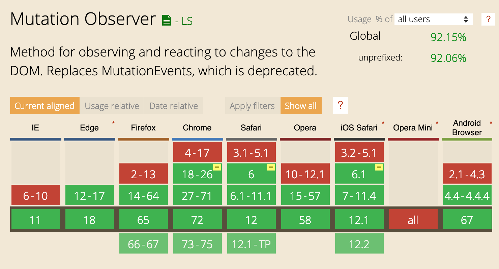

# Mutation Observer

Do something when the DOM changes.

Strong browser support since 2012.

https://caniuse.com/#feat=mutationobserver

https://developer.mozilla.org/en-US/docs/Web/API/MutationObserver