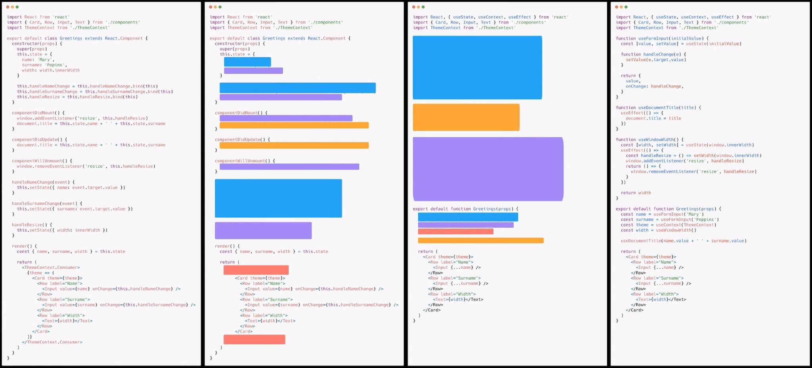

# Hooks

- [Introduced in October 2018](https://medium.com/@dan_abramov/making-sense-of-react-hooks-fdbde8803889)
- Released in React v16.8.0 (February 2019)
- Useful for grouping reusable logic
- Brings state to functional components

[Image source](https://twitter.com/andychilton/status/1057089468769828864)
